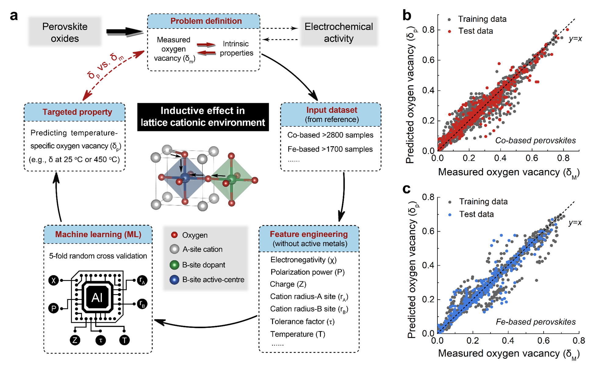

# MLtoolbox for Prediction of Perovskite Oxygen Vacancies for Oxygen Electrocatalysis at Different Temperatures

Source code and datasets for the submission of 'Prediction of Perovskite Oxygen Vacancies for Oxygen Electrocatalysis at Different Temperatures'

Zhiheng Li1,2,8£, Xin Mao3£, Desheng Feng1£, Mengran Li4*, Xiaoyong Xu1,5*, Yadan Luo6*, Linzhou Zhuang7, Rijia Lin1, Tianjiu Zhu1, Fengli Liang1, Zi Huang6, Dong Liu8, Zifeng Yan8, Aijun Du3, Zongping Shao9* and Zhonghua Zhu1*

**Affiliations:**
1. School of Chemical Engineering, The University of Queensland, Brisbane, 4072, Australia
2. Center of Artificial Photosynthesis for Solar Fuels and Department of Chemistry, School of Science and Research Center for Industries of the Future, Westlake University, Hangzhou 310030, China.
3. School of Chemistry and Physics and Centre for Materials Science, Queensland University of Technology, Brisbane, 4001, Australia
4. Department of Chemical Engineering, The University of Melbourne, Melbourne, 3010, Australia
5. School of Chemical Engineering, The University of Adelaide, Adelaide, 5005, Australia
6. School of Information Technology and Electrical Engineering, The University of Queensland, Brisbane, 4072, Australia
7. School of Chemical Engineering, East China University of Science and Technology, Shanghai, 200237, China
8. School of Chemical Engineering, China University of Petroleum, Qingdao, 266580, China
9. WASN: Minerals, Energy and Chemical Engineering, Curtin University, Perth, 6845, Australia


<p align="center">

</p>


## Abstract
Efficient catalysts are imperative to accelerate the slow oxygen reaction kinetics for the development of emerging electrochemical energy systems ranging from room-temperature alkaline water electrolysis to high-temperature ceramic fuel cells [1,2]. Typically, experimental catalyst screening, particularly for high-temperature applications, is a time-consuming and labour-intensive process. Theoretical prediction provides an alternative route for efficient catalyst screening, but it is usually challenging to identify a simple descriptor to suit different temperatures due to temperature-dependent electrode reactions [3]. In this work, we reveal the role of cationic inductive interactions in predetermining the oxygen vacancy concentrations of 235 cobalt-based and 200 iron-based perovskite catalysts at different temperatures, and this trend can be well predicted from machine learning techniques based on the cationic lattice environment, requiring no heavy computational and experimental inputs. Our results further show that the catalytic activity of the perovskites is oxygen vacancy concentration correlated with strong temperature dependence. We then provide a new machine learning-guided route for the development of oxygen electrocatalysts suitable for operation at different temperatures with time efficiency and good prediction accuracy. This work revealed the dominant role of local cationic environment in determining the state of redox-active metal centres and thus the concentration of the oxygen vacancies over perovskites, enabling rational development of new catalysts for energy applications. 


----
## Contents
* [Requirements](#requirements)
* [Datasets](#datasets)
* [Demo](#demo)
<!--   * [Video Demo](#video-demo) -->
* [Citation](#citation)
* [Contact](#contact)

## Requirements
- Python 3.8 and activate the conda environment
```bash
conda create -n ml-pero python=3.8

conda activate ml-pero
```
- Then install all the library with: 

```bash
pip install -r requirement.txt
```

## Datasets
To reproduce the results for oxygen vacancy prediction, we have prepared a cleaned version of data files:
- `data_Co.xlsx` for Co-based 221 perovskites and 
- `data_Fe.xlsx` for Fe-based 93 perovskites.

To prepare the dataset, please refer to `1_main_prediction.ipynb`.

Six attributes are pre-calculated:
- Polarization
- Charge
- Electronegativity
- Radius A-site
- Radius B-site
- Temperature

To investigate the detailed list of the perovskites and the procedure of how features are preprocessed, please refer to the folder `data`.

## Demo

We have trained and evaluated 42 regression models on two datasets, with 80% of data used for training and the rest 20% if data for testing. The models are evaluated in a manner of 5-fold cross validation. 

Comprehensive visualisations of regression performance, correlation study are provided. For more details, please refer to the `1_main_prediction.ipynb`.


---
## Citation
If you find this repository useful, please cite our paper:


---
### Acknowledgments
Acknowledgments: The authors acknowledge the technical assistance from the Centre for Microscopy and Microanalysis (CMM) at the University of Queensland and Australian Synchrotron. The authors would like to thank Dr. Jinxuan Zhang’s assistance with the scanning electron microscope. Fundings: Z. Zhu and A. Du would like to thank the support from the Australian Research Council (ARC) Discovery Project DP170104660. Z. Zhu also acknowledges the support from ARC DP DP200101397. Z. Li acknowledges the China Scholarship Council (CSC) for awarding a visitor’s scholarship (No. 201706450223) in Australia. We acknowledge support from ARC DE230100637 and the Australian Synchrotron Project (M15364, M15867, and M21058). Y. Luo acknowledges financial support from ARC DE240100105. Y. Luo and Z. Huang acknowledge the support from CE200100025. Z. Huang appreciates the support from ARC DP230101196. Author contributions: M. Li, Y. Luo, Z. Huang, Z. Shao, Z. Zhu conceptualized the project. M. Li, Y. Luo, X. Xu, Z. Zhu, D. Liu, Z. Yan supervised the project. Z. Li collected literature data for machine learning. Y. Luo, M. Li, Z. Huang conducted feature engineering and machine learning model training and validation.  Z. Li and D. Feng synthesized the materials and tested the performance with the help of X. Xu, M. Li, D. Sheng, F. Liang. X. Mao and A. Du performed theoretical investigations. M. Li, L. Zhuang, R. Lin, F. Liang performed the material characterizations and analysis. Z. Li and M. Li wrote the manuscript. 


---
### Contact
[Mengran Li](https://scholar.google.com/citations?user=lQ3B9ksAAAAJ&hl=en) <br>
m.li6 AT uq DOT edu.au <br>
[Yadan Luo](https://scholar.google.com/citations?user=3IfL11AAAAAJ&hl=en) <br>
y.luo AT uq DOT edu.au <br>

