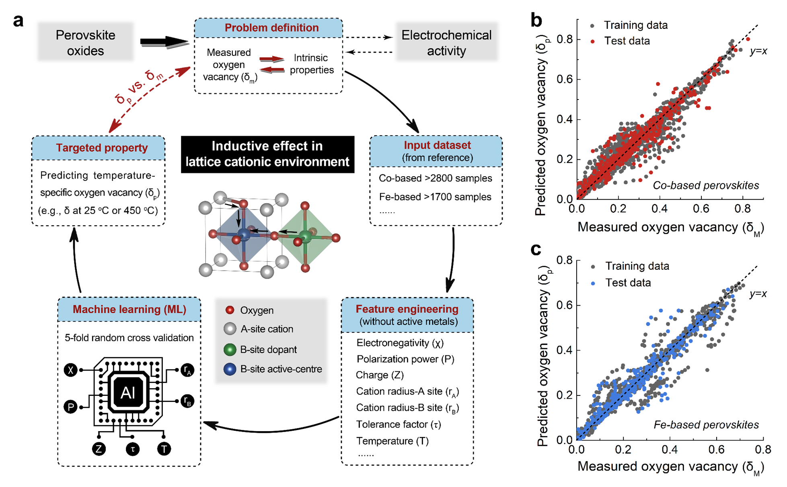

# MLtoolbox for Prediction of Perovskite Oxygen Vacancies for Oxygen Electrocatalysis at Different Temperatures

[](https://github.com/yourrepo/status)
[](https://opensource.org/licenses/MIT)
[](https://github.com/yourrepo/yourproject/releases)
[](https://www.python.org/downloads/)
[](https://doi.org/your_doi)

Source code and datasets for the research article **"Prediction of Perovskite Oxygen Vacancies for Oxygen Electrocatalysis at Different Temperatures"**

**Authors:** Zhiheng Li<sup>1,2,8</sup>, Xin Mao<sup>3</sup>, Desheng Feng<sup>1</sup>, Mengran Li<sup>4</sup>\*, Xiaoyong Xu<sup>1,5</sup>\*, Yadan Luo<sup>6</sup>\*, Linzhou Zhuang<sup>7</sup>, Rijia Lin<sup>1</sup>, Tianjiu Zhu<sup>1</sup>, Fengli Liang<sup>1</sup>, Zi Huang<sup>6</sup>, Dong Liu<sup>8</sup>, Zifeng Yan<sup>8</sup>, Aijun Du<sup>3</sup>, Zongping Shao<sup>9</sup>\*, Zhonghua Zhu<sup>1</sup>\*

**Equal Contribution:** £ Zhiheng Li, Xin Mao, and Desheng Feng have made equal contributions to this paper.

## Table of Contents
- [Abstract](#abstract)
- [Installation](#installation)
- [Usage](#usage)
- [Data](#data)
- [Results](#results)
- [Citation](#citation)
- [Acknowledgments](#acknowledgments)
- [Contact](#contact)

## Abstract
The development of efficient catalysts is essential to accelerate the sluggish kinetics of oxygen reactions, which is critical for advancing electrochemical energy systems such as alkaline water electrolysis and high-temperature ceramic fuel cells. Traditional experimental screening of catalysts, particularly for high-temperature applications, is often labor-intensive and time-consuming. This research aims to utilize machine learning techniques to predict the presence of oxygen vacancies in perovskite materials, thereby expediting the catalyst development process.

<p align="center">

</p>

## Installation
To utilize this repository, please clone the repository as follows:
```bash
git clone https://github.com/yourrepo/MLtoolbox.git
cd MLtoolbox
```

Be sure to use Python 3.8 and activate the conda environment
```bash
conda create -n ml-pero python=3.8

conda activate ml-pero
```
Then install all the necessary dependencies: 

```bash
pip install -r requirement.txt
```

## Usage
### Data Preparation
Ensure that the datasets are correctly placed in the `data` directory.
To reproduce the results for oxygen vacancy prediction, we have prepared a cleaned version of data files:
- `data_Co.xlsx` for Co-based 221 perovskites and 
- `data_Fe.xlsx` for Fe-based 93 perovskites.

Six attributes are pre-calculated:
- Polarization
- Charge
- Electronegativity
- Radius A-site
- Radius B-site
- Temperature

To investigate the detailed list of the perovskites and the procedure of how features are preprocessed, please refer to the folder `data`.


### Model Training and Visualization
We have trained and evaluated 42 regression models on two datasets, with 80% of data used for training and the rest 20% if data for testing. The models are evaluated in a manner of 5-fold cross validation. 

Comprehensive visualisations of regression performance, correlation study are provided. For more details, please refer to the `1_main_prediction.ipynb`.


## Results
Our machine learning models demonstrated significant predictive capabilities for oxygen vacancies in perovskite materials. The results indicate potential pathways for optimizing catalyst design for various electrochemical applications.

## Citation
If this repository contributes to your research, please consider citing our work:
```
@article{TBD,
  title={Prediction of Perovskite Oxygen Vacancies for Oxygen Electrocatalysis at Different Temperatures},
  author={Zhiheng Li et al.},
  journal={TBD},
  year={2024},
  volume={TBD},
  pages={TBD}
}
```

## Acknowledgments
The authors express their gratitude for the technical support provided by the Centre for Microscopy and Microanalysis (CMM) at the University of Queensland and the Australian Synchrotron. Special thanks to Dr. Jinxuan Zhang for assistance with scanning electron microscopy. This research was supported by various ARC grants and scholarships, including ARC Discovery Project DP170104660, DP200101397, and DE230100637. We also acknowledge financial support from the China Scholarship Council (No. 201706450223) and other grants listed in the detailed acknowledgment section.

## Contact
This work mainly corresponds to:
- **Mengran Li:** [Google Scholar](https://scholar.google.com/citations?user=lQ3B9ksAAAAJ&hl=en)  
  Email: aaron.li1@unimelb.edu.au

- **Xiaoyong Xu:**  
  Email: xiaoyong.xu@adelaide.edu.au

- **Yadan Luo:** [Google Scholar](https://scholar.google.com/citations?user=3IfL11AAAAAJ&hl=en)  
  Email: y.luo@uq.edu.au

- **Zongping Shao:**  
  Email: zongping.shao@curtin.edu.au

- **Zhonghua Zhu:**  
  Email: z.zhu@uq.edu.au

---

